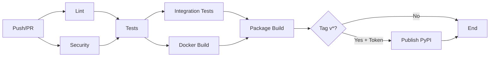

# GitHub Actions CI/CD Pipeline

##  Status Atual

###  O que funciona AGORA (sem configuração):

1. **Lint & Code Quality**
   - Black formatter check
   - isort import checker
   - flake8 linting
   - Pyright type checking

2. **Security Scanning**
   - Bandit (código Python)
   - Safety (dependências vulneráveis)
   - Trivy (imagens Docker)

3. **Automated Testing**
   - Unit tests (Python 3.11, 3.12, 3.13)
   - Integration tests
   - Coverage reports (Codecov)
   - Multi-OS (Ubuntu, macOS, Windows)

4. **Docker**
   - Build de imagens
   - Validação de containers
   - Multi-platform support

5. **Package Building**
   - Build de pacote Python
   - Validação com twine
   - Artefatos disponíveis

###  O que requer configuração (opcional):

6. **Publish to PyPI**
   - **Status:** DESABILITADO (sem secret)
   - **Requer:** `PYPI_API_TOKEN` secret
   - **Como configurar:** Ver [INFRASTRUCTURE_GUIDE.md](../docs/INFRASTRUCTURE_GUIDE.md)
   - **Custo:** GRÁTIS
   - **Tempo:** 5 minutos

###  O que NÃO está configurado:

7. **Cloud Deployment**
   - Kubernetes clusters (AWS/Azure/GCP)
   - Load balancers
   - Auto-scaling
   - **Custo:** $100-300/mês
   - **Complexidade:** Alta

8. **Quantum Hardware**
   - IBM Quantum Experience
   - AWS Braket
   - Azure Quantum
   - **Custo:** Variável ($0-100K+/ano)
   - **Complexidade:** Muito alta

---

##  Pipeline Workflow



---

##  Jobs Detalhados

### 1. Lint (sempre executa)
```yaml
Triggers: push, pull_request
Duração: ~2 minutos
Requer: Nada
```

**O que faz:**
- Verifica formatação com Black
- Ordena imports com isort
- Valida sintaxe com flake8
- Type checking com Pyright

### 2. Security (sempre executa)
```yaml
Triggers: push, pull_request, schedule (semanal)
Duração: ~3 minutos
Requer: Nada
```

**O que faz:**
- Scan de vulnerabilidades com Bandit
- Verifica dependências com Safety
- Scan de imagens Docker com Trivy

### 3. Tests (sempre executa)
```yaml
Triggers: push, pull_request
Duração: ~5-10 minutos
Requer: Nada
Matrix:
  - Python: 3.11, 3.12, 3.13
  - OS: ubuntu, macos, windows
```

**O que faz:**
- Executa pytest com cobertura
- Upload para Codecov (grátis para repos públicos)
- Falha se cobertura < 60%

### 4. Integration Tests (sempre executa)
```yaml
Triggers: após tests + security
Duração: ~5 minutos
Requer: Nada
Timeout: 5 minutos
```

**O que faz:**
- Testes end-to-end
- Validação de workflows completos

### 5. Docker Build (sempre executa)
```yaml
Triggers: após lint + security
Duração: ~5 minutos
Requer: Nada
```

**O que faz:**
- Build de imagem Docker
- Testa container
- **NÃO publica** (sem registry configurado)

### 6. Package Build (sempre executa)
```yaml
Triggers: após tests + lint
Duração: ~2 minutos
Requer: Nada
```

**O que faz:**
- Build com python -m build
- Validação com twine
- Upload de artefatos para GitHub

### 7. Publish PyPI (condicional)
```yaml
Triggers: push de tag v* + PYPI_API_TOKEN configurado
Duração: ~1 minuto
Requer: PYPI_API_TOKEN secret
```

**O que faz:**
- Download do pacote build
- Publica no PyPI
- **IMPORTANTE:** Só executa se secret existir

**Como habilitar:**
```bash
# 1. Criar conta no PyPI
https://pypi.org/account/register/

# 2. Criar API Token
Account Settings → API tokens → Add API token

# 3. Adicionar secret no GitHub
Repositório → Settings → Secrets → Actions
Nome: PYPI_API_TOKEN
Valor: pypi-AgEIcHlwaS5vcmcC...

# 4. Criar release
git tag v1.0.0
git push origin v1.0.0

# 5. Pipeline publica automaticamente!
```

---

##  Secrets Configurados

### Padrão (já funcionam):
```yaml
GITHUB_TOKEN: Fornecido automaticamente pelo GitHub
```

### Opcionais (não configurados):
```yaml
PYPI_API_TOKEN: Token do PyPI (para publicação)
```

### Futuros (para cloud deploy):
```yaml
AWS_ACCESS_KEY_ID: AWS credentials
AWS_SECRET_ACCESS_KEY: AWS credentials
AZURE_CREDENTIALS: Azure credentials
GCP_SA_KEY: Google Cloud service account
IBM_QUANTUM_TOKEN: IBM Quantum hardware access
```

---

##  Como Usar

### Para Desenvolvimento (AGORA):
```bash
# 1. Fazer alterações
git checkout -b feature/minha-feature

# 2. Commit
git commit -m "feat: adiciona nova feature"

# 3. Push
git push origin feature/minha-feature

# 4. Abrir PR
# GitHub Actions executa automaticamente:
#  Lint
#  Security scans
#  Tests
#  Docker build
#  Package build
```

### Para Publicar no PyPI (5 minutos de config):
```bash
# 1. Configurar PYPI_API_TOKEN (uma vez)
# Ver seção "Publish PyPI" acima

# 2. Criar release
git tag v1.0.0
git push origin v1.0.0

# 3. Pipeline publica automaticamente!
# Aguardar ~15 minutos

# 4. Instalar de qualquer lugar
pip install houdinis
```

---

##  Métricas do Pipeline

### Tempo Total (sem deploy):
```
Lint:        ~2 min
Security:    ~3 min
Tests:       ~10 min (paralelo: ubuntu, macos, windows)
Integration: ~5 min
Docker:      ~5 min
Package:     ~2 min

Total:       ~15-20 minutos
```

### Tempo com PyPI Deploy:
```
Todo o pipeline acima: ~15-20 min
PyPI publish:          ~1 min

Total:                 ~16-21 minutos
```

### Custo Mensal:
```
GitHub Actions: GRÁTIS (2,000 minutos/mês para repos públicos)
PyPI hosting:   GRÁTIS
Codecov:        GRÁTIS (repos públicos)

Total:          $0/mês 
```

---

##  Limitações Atuais

### 1. Sem Deploy Automático em Cloud
**Motivo:** Requer infraestrutura cloud paga (EKS/AKS/GKE)  
**Custo:** $100-300/mês  
**Quando configurar:** Quando houver necessidade de ambiente de produção

### 2. Sem Publicação de Imagens Docker
**Motivo:** Sem registry configurado (Docker Hub, GHCR)  
**Custo:** GRÁTIS (Docker Hub) ou $0.50/GB (GHCR)  
**Quando configurar:** Quando houver consumidores externos

### 3. Sem Acesso a Quantum Hardware Real
**Motivo:** Sem tokens configurados (IBM/AWS/Azure)  
**Custo:** Variável ($0 free tier até $100K+/ano)  
**Quando configurar:** Quando precisar de computação quântica real

---

##  Troubleshooting

### Problema: Tests falhando
```bash
# Ver logs no GitHub Actions
# Executar localmente:
pytest tests/ -v

# Se passar localmente mas falhar no CI:
# - Verificar dependências (requirements.txt)
# - Verificar versão do Python
# - Verificar sistema operacional (Windows vs Linux)
```

### Problema: Coverage abaixo de 60%
```bash
# Adicionar mais testes
pytest tests/ --cov=. --cov-report=html

# Ver relatório
open htmlcov/index.html

# Aumentar cobertura antes de fazer PR
```

### Problema: Security scan detectou vulnerabilidade
```bash
# Ver detalhes no GitHub Actions

# Atualizar dependências
pip install --upgrade -r requirements.txt

# Verificar localmente
bandit -r . -ll
safety check
```

### Problema: PyPI publish falhou
```bash
# Verificar:
1. PYPI_API_TOKEN está configurado?
2. Tag começa com 'v'? (v1.0.0)
3. Versão no setup.py está correta?
4. Pacote já existe no PyPI com mesma versão?

# Solução comum: incrementar versão
# setup.py: version='1.0.1'
git tag v1.0.1
git push origin v1.0.1
```

---

##  Documentação Adicional

- **Infraestrutura completa:** [INFRASTRUCTURE_GUIDE.md](../docs/INFRASTRUCTURE_GUIDE.md)
- **Configuração de secrets:** [GitHub Secrets Docs](https://docs.github.com/en/actions/security-guides/encrypted-secrets)
- **PyPI publishing:** [PyPI Help](https://pypi.org/help/)
- **GitHub Actions:** [Actions Documentation](https://docs.github.com/en/actions)

---

##  Checklist de Deploy

### Desenvolvimento (AGORA):
- [x] CI/CD configurado
- [x] Tests automatizados
- [x] Security scans
- [x] Docker builds
- [x] Package builds
- [x] Coverage reports

### Publicação Simples (5 minutos):
- [ ] Conta PyPI criada
- [ ] PYPI_API_TOKEN configurado
- [ ] Primeira release publicada

### Produção Enterprise (semanas):
- [ ] Cloud provider escolhido
- [ ] Kubernetes cluster criado
- [ ] Secrets cloud configurados
- [ ] Load balancer configurado
- [ ] Monitoramento configurado
- [ ] Logs centralizados
- [ ] Auto-scaling configurado

---

**Status do Pipeline:**  FUNCIONAL (Desenvolvimento)  
**Última atualização:** Dezembro 2025  
**Mantenedor:** Houdinis Framework Team
